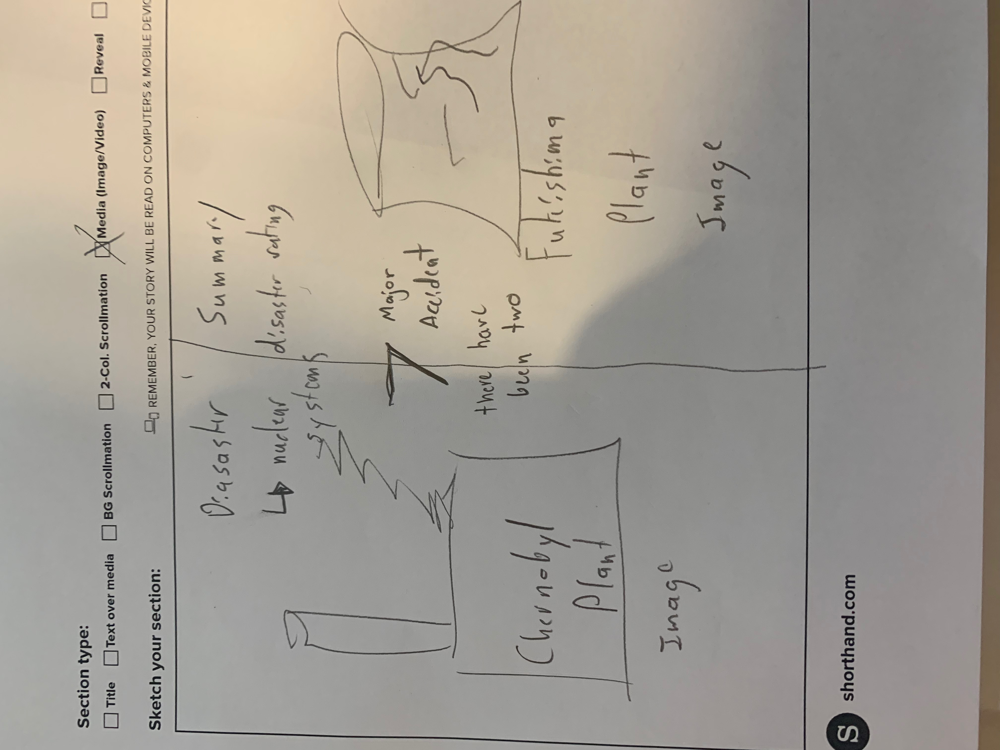
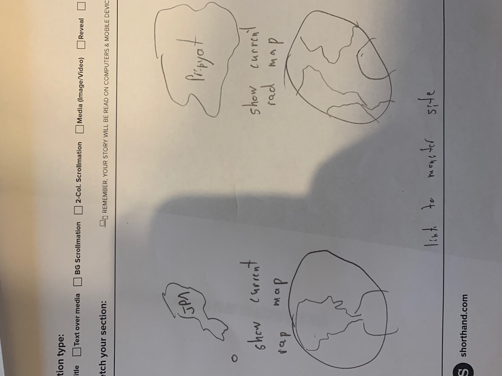
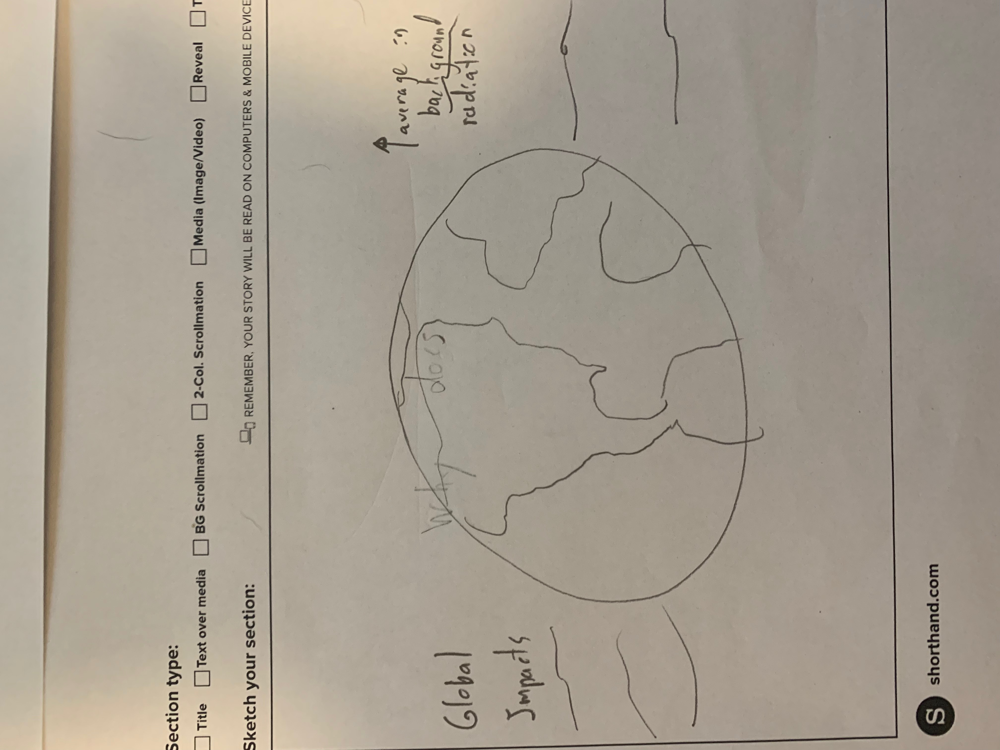
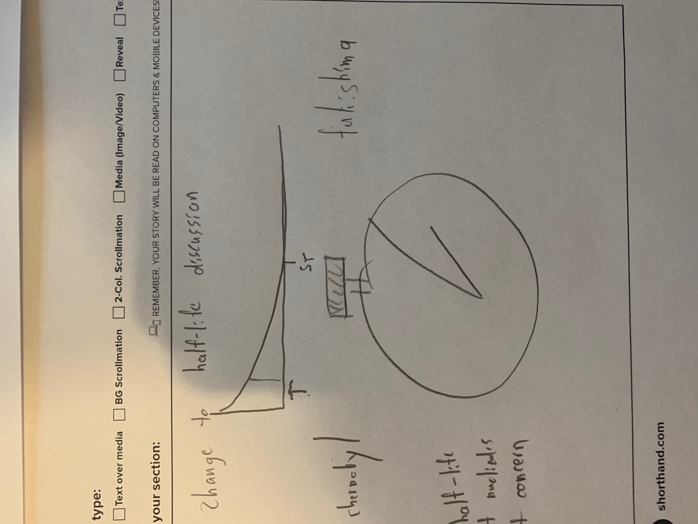
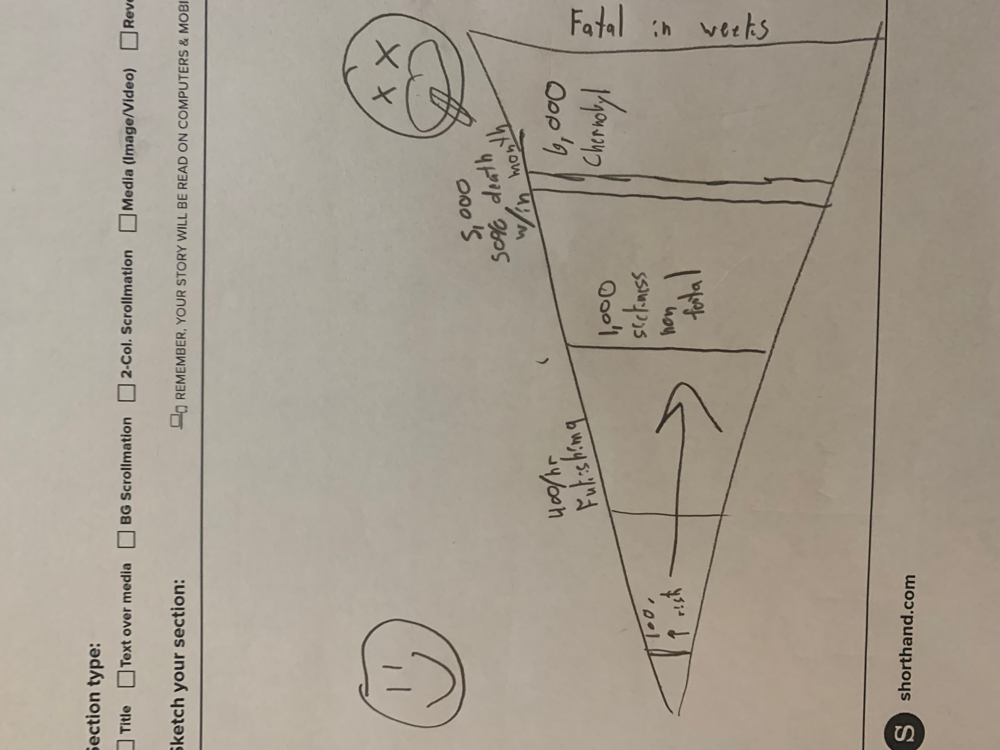
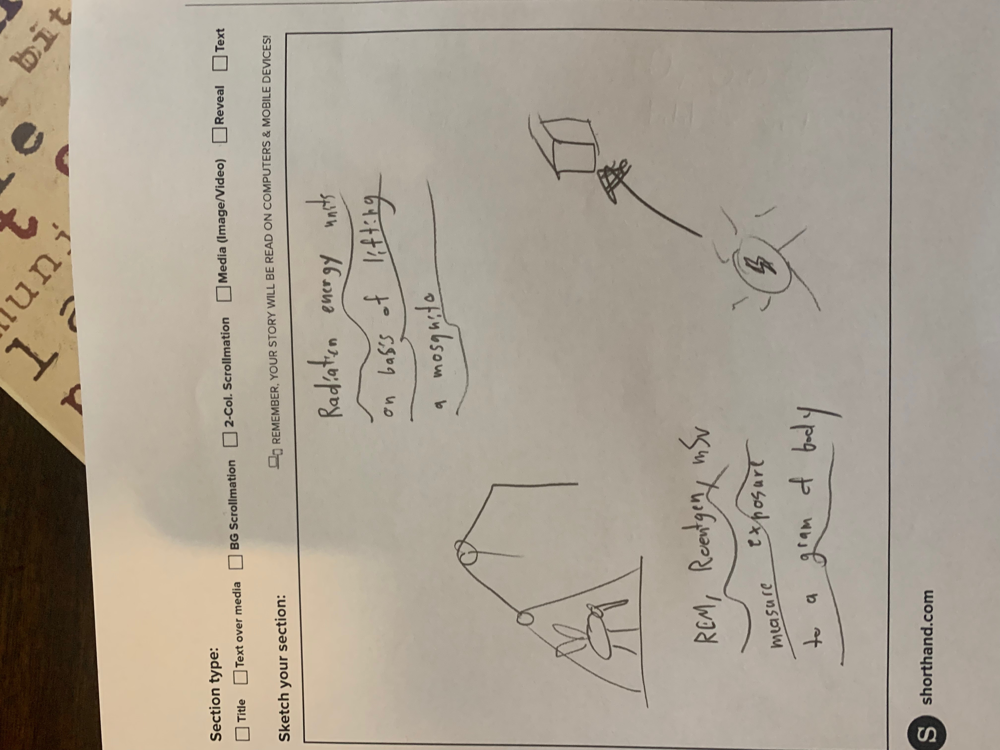
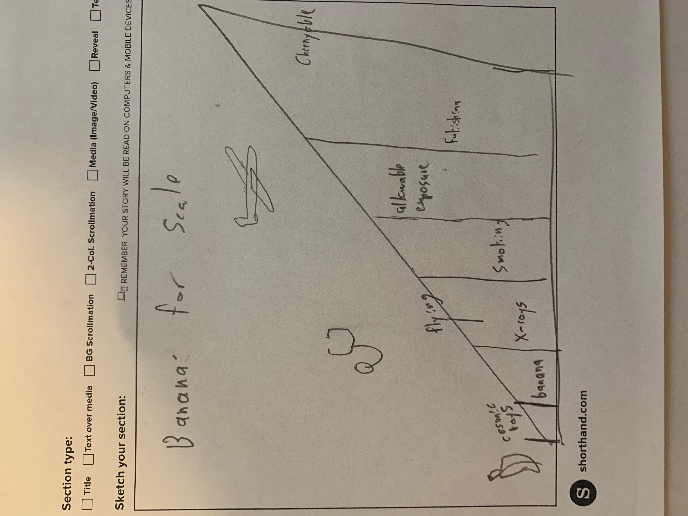

# Final Part 2
## Wireframe Sketches

## Interview Discussion

a. the target audience you hope to reach with your story

General public reader, with interest or concern with the biological effects of radiation but no background in nuclear physics. The idea is to frame all information in a very simplistic, easy to digest way.

b. your approach to identifying representative individuals to interview; 

I think it will be quite easy to find representatives to interview. The field of study is not highly adopted around this area but it is something most people have had some sort of exposure to, as nuclear radiation is a theme that appears in all types of popular culture. Specifically, there has been a recent resurgence of interest in nuclear accidents due to the HBO series, Chernobyl. So, I’ll find interviewees at work, school, and with old friends and family.

c. your interview script; 
	
Were explanations and terms easy enough to understand?
Could you give me a brief summary of what exposure is and how we measure it?
Is there anything you didn’t understand?
What do you think the overall message of the presentation is?	
Is there anything else you would like to see in this presentation?

d. the findings from your interviews; 

The concepts were able to be explained at the level I expected, and the message was getting across. Most people were surprised at how prevalent radioactive exposure was in their daily lives and enjoyed the everyday examples. There was still some confusion around why a previously dangerous area could be safe now.	

e. changes you implemented to your sketches, storyboards and wireframes to address the issues identified.

Added a discussion on half-lives and how radioactivity decreases over time.
Considered adding and additional graphic on more everyday items that are radioactive.

[Return to Main](/README.md)
